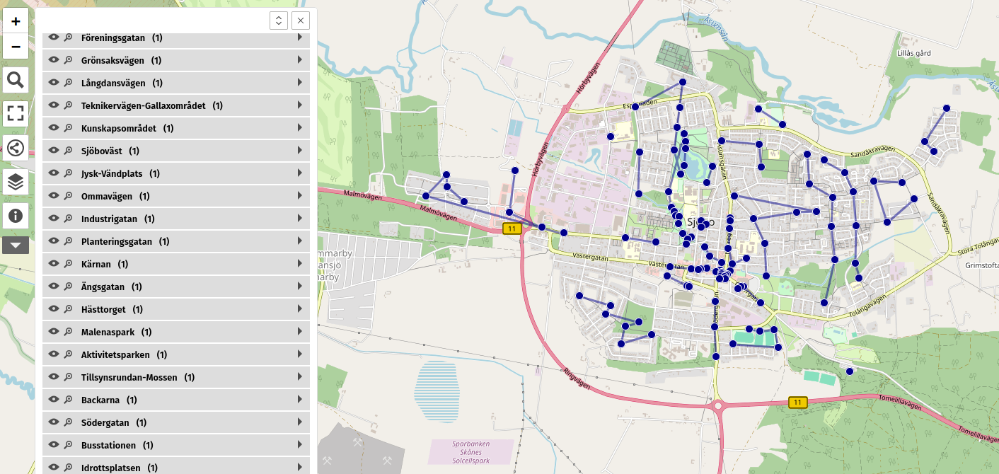

# soprundan-sjobo
Gatukontoret tömmer offentliga sopkorgar i Sjöbo tätort. Det finns totalt cirka 120 sopkorgar och tar två personer en arbetsdag att tömma alla sopkorgar. Syftet med projektet är att markera ut sopkorgarna på en karta och ge ett exempel på bästa körväg genom Sjöbo tätort för att tömma sopkorgarna
## Sopkorgar
https://umap.openstreetmap.de/sv/map/soprundan_66709#14/55.6289/13.6866 

## Bästa körväg och antal sopkorgar
Västergatan = 5 st 
Gamlatorg = 11 st 
Östergatan = 4 st 
Oran = 1 st 
Idrottsplatsen = 5 st 
Busstationen = 4 st 
Södergatan = 3 st 
Backarna = 7 st 
Tillsynsrundan/Mossen = 12 st 
Aktivitetsparken = 3 st 
Malenas Park = 4 st 
Hästtorget = 3 st 
Ängsgatan = 2 st 
Kärnan = 3 st 
Planteringsgatan = 2 st 
Industrigatan = 2 st 
Ommavägen = 1 st 
Jysk/Vändplats = 3 st 
Sjöbo Väst = 5 st 
Kunskapsområdet = 3 st 
Teknikervägen/Gallaxområdet = 4 st 
Långdansvägen = 6 st 
Grönsaksvägen = 6 st 
Föreningsgatan = 6 st 
Linvägen = 3 st 
Hundparken = 2 st 
Norregatan = 5 st 